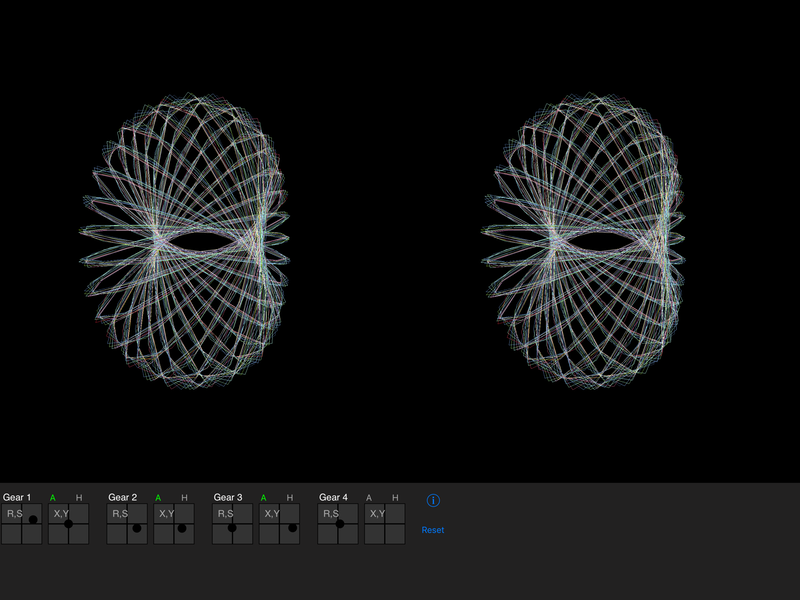

# Spirograph
3D Spirograph for iPad uses Swift and Metal

Four gear Spirograph rotates in 3D to sometimes create interesting images.

Written mostly as a way to practice a new way of getting Swift to access arrays in a structure used by Metal.\
(trying to avoid the [tuple,tuple,tuple,tuple,tuple,....]  bullshit that Swift thinks is so cleaver).\
You can see the result in Spriograph.h and .m\
Not perfect, but it least workable.

